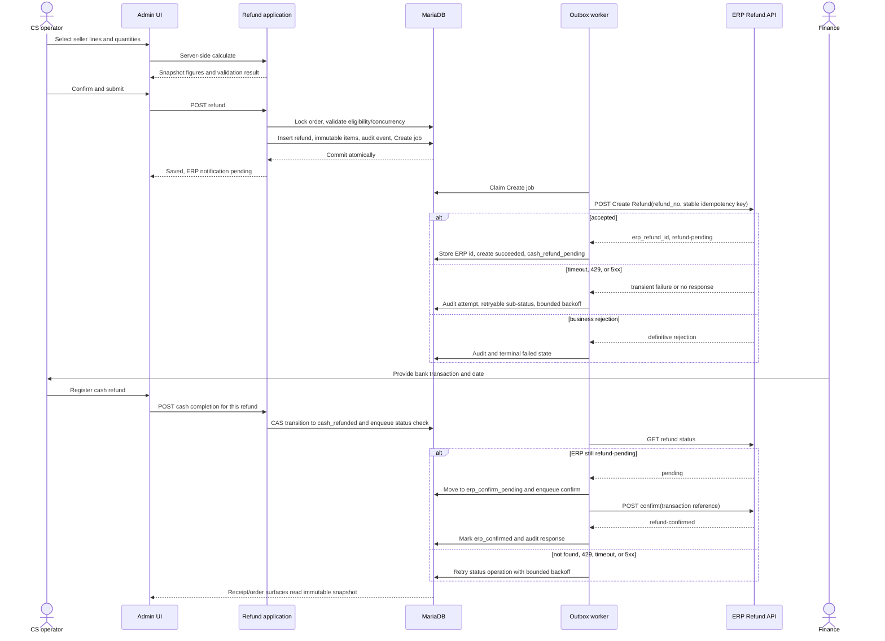

# 02 - Refund Design

## End-to-end flow

The browser never invents a lifecycle state. The local refund snapshot and its Create outbox row commit together; ERP work is bounded and retryable outside the submit transaction.

The FRD contains a conflict between a scheduled status sweep in section 9.2 and the operator-driven, per-refund status read in section 4. I would implement the latter for v1, with the same outbox worker and a scheduled reconciliation command as a recovery path; this preserves the human cash gate without requiring a global scan on the critical path.

## Phased delivery plan

| Epic | Dependency | Acceptance gate |
| --- | --- | --- |
| Refund domain and eligibility | None | Seller-only selection, contractual window, server-side quantity checks, immutable money/tax snapshot, and concurrent submission tests pass. |
| Admin worklist and cash registration | Domain | ACLs are enforced; operators can register transaction number/date once; state transitions are CAS-protected and auditable. |
| ERP Create integration | Domain plus outbox | Commit-before-notify works; stable `refund_no` idempotency survives timeout/replay; transient and business failures are distinct. |
| ERP status and confirm | Create plus cash registration | Only `cash_refunded` records can confirm; read-before-confirm is bounded, replayable, and idempotent on `erp_refund_id`. |
| Customer and downstream presentation | Immutable snapshot | Receipt, account, history, email, and export show the same original figures and refund breakdown; PDF/tax acceptance is signed off. |
| Operability and scale hardening | All prior epics | Paged worklist meets 1.5-second first-page target, settlement scan is indexed/bounded, dashboards and alerts cover dead jobs and ERP latency. |

Each epic has a contract-level unit test and a container integration test before the next external boundary is enabled.
